<div align="center">


<br>

[](https://github.com/TekRantGaming/point-blank-recompiled/releases/latest)
[](https://github.com/TekRantGaming/point-blank-recompiled/releases)


### Namco's Point Blank on PC, running natively. Shoot with your mouse or an Xbox controller, no light gun needed.

[](https://github.com/TekRantGaming/point-blank-recompiled/releases/latest)

<sub>The original PlayStation game code, translated to native PC code with <a href="https://github.com/mstan/psxrecomp">PSXRecomp</a>. <b>No game files included</b>: bring your own disc image of Point Blank (PlayStation, North America, SLUS-00481).</sub>

</div>

<br>

## Highlights

<table>
<tr>
<td width="33%" valign="top">

**Aim with your mouse**<br>
The game thinks a real Namco GunCon is plugged in. Point the cursor at the screen and click to shoot, exactly where you aim.

</td>
<td width="33%" valign="top">

**Or with a controller**<br>
Xbox, PlayStation and other controllers work too. The sticks move an on-screen sight, and the right trigger fires.

</td>
<td width="33%" valign="top">

**Two players**<br>
Plug in a second controller and Player 2 gets their own gun and sight, red against blue, just like the arcade.

</td>
</tr>
<tr>
<td valign="top">

**Straight to the action**<br>
The long opening movies are skipped, so the title screen is up in seconds. You can switch them back on in the launcher's Mods list.

</td>
<td valign="top">

**Native, not emulated**<br>
Every function of the game was translated from PlayStation code to C and compiled for your PC. Your CPU runs the game directly.

</td>
<td valign="top">

**PC graphics options**<br>
FXAA, sharpening, brightness, higher internal resolution, fullscreen, VSync and an FPS counter, all set in the launcher.

</td>
</tr>
</table>

## In game

<div align="center">
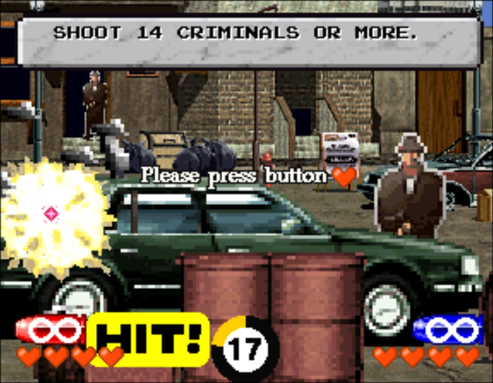
</div>

<table>
<tr>
<td width="50%">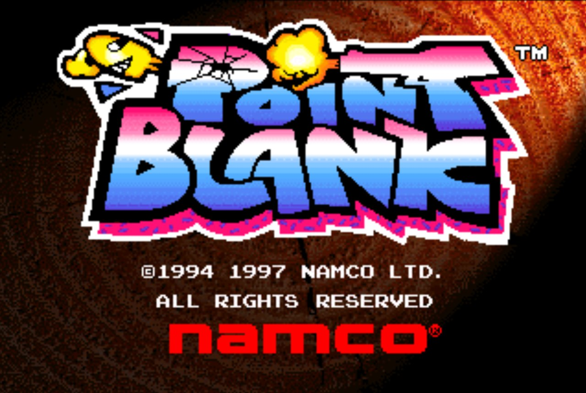</td>
<td width="50%">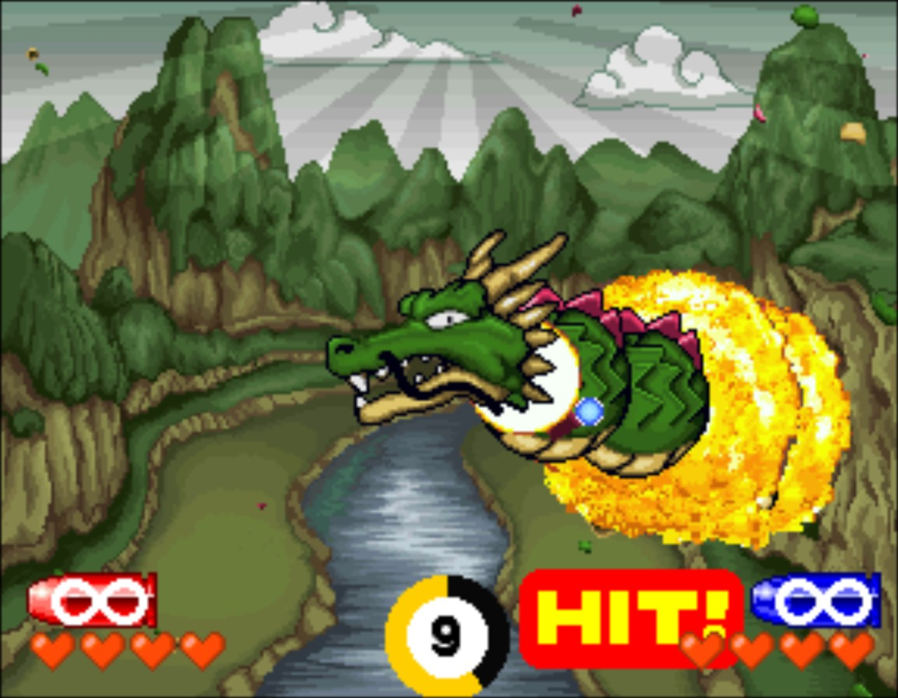</td>
</tr>
<tr>
<td width="50%">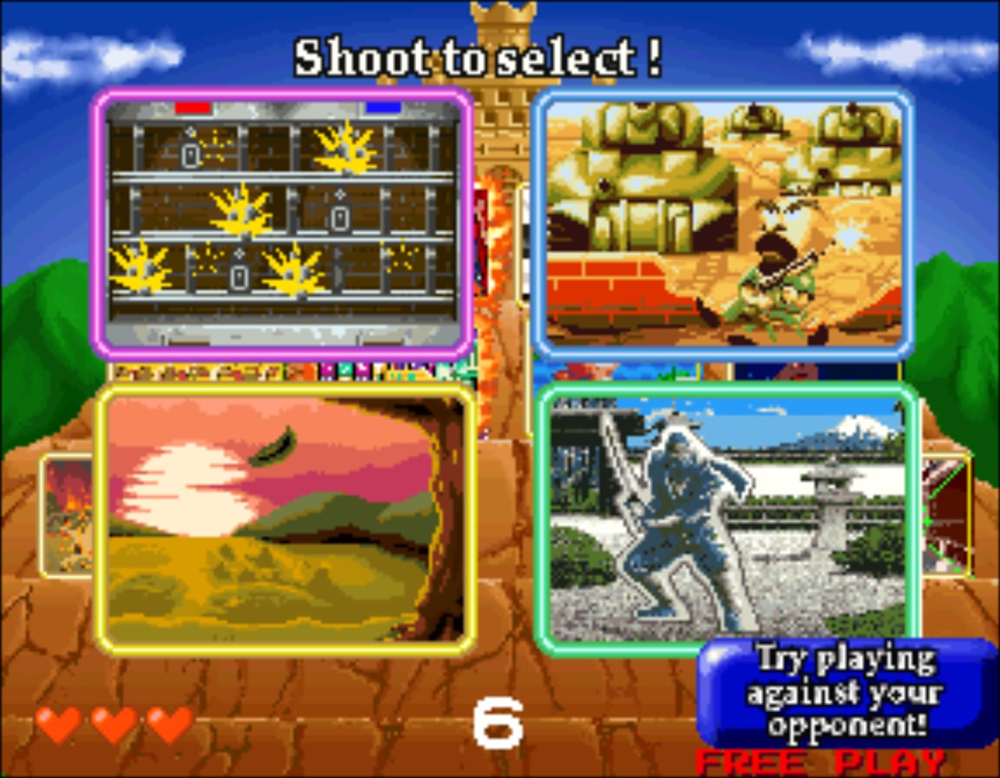</td>
<td width="50%">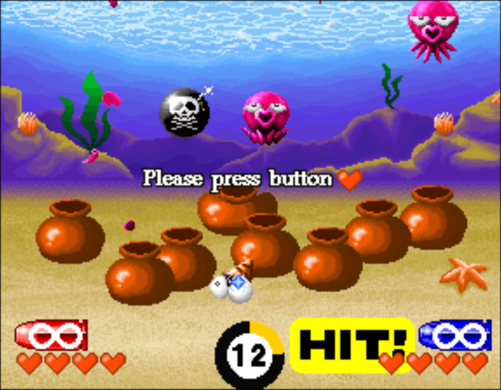</td>
</tr>
<tr>
<td width="50%">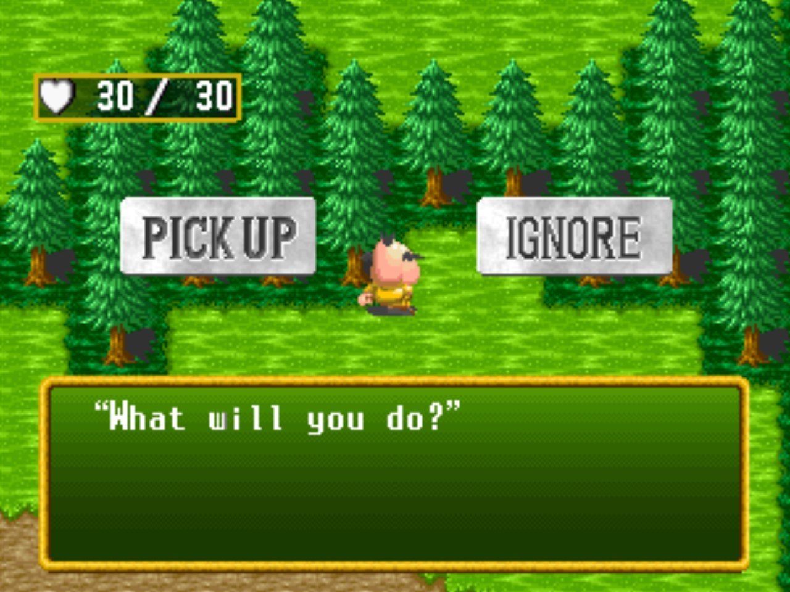</td>
<td valign="middle">

**Every mode is here:** Arcade, the console-only **Arrange** mode with its adventure board and side quests, Training, Beginner and Expert stages, and two-player versus.

</td>
</tr>
</table>

### Light gun, without the light gun

Point Blank was made for Namco's GunCon light gun, which only works on old CRT televisions. This port emulates the GunCon itself: wherever your mouse cursor or controller sight points on the picture becomes the spot the "gun" reports to the game. The game's own gun calibration and menus work as they did on the console.

<table>
<tr>
<td width="55%">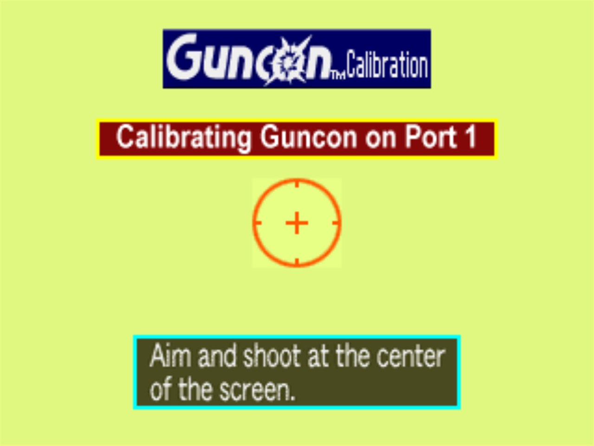</td>
<td valign="middle">

### Calibration
The first time you play, the game asks you to shoot the centre of the screen. Click the middle of the target (or aim the sight there and pull the trigger), then press **A** to finish.

</td>
</tr>
<tr>
<td valign="middle">

### Controller sight
With a controller, a crosshair is drawn over the game so you can see where you are aiming: **red** for Player 1, **blue** for Player 2. Move the mouse and it hands aiming straight back to the cursor.

</td>
<td width="55%">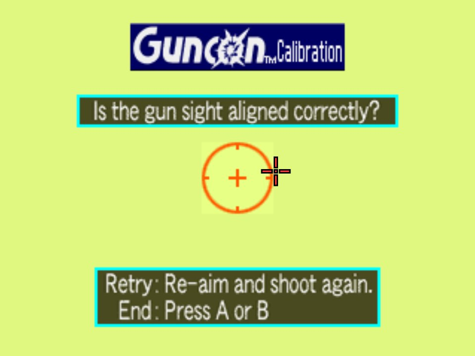</td>
</tr>
<tr>
<td>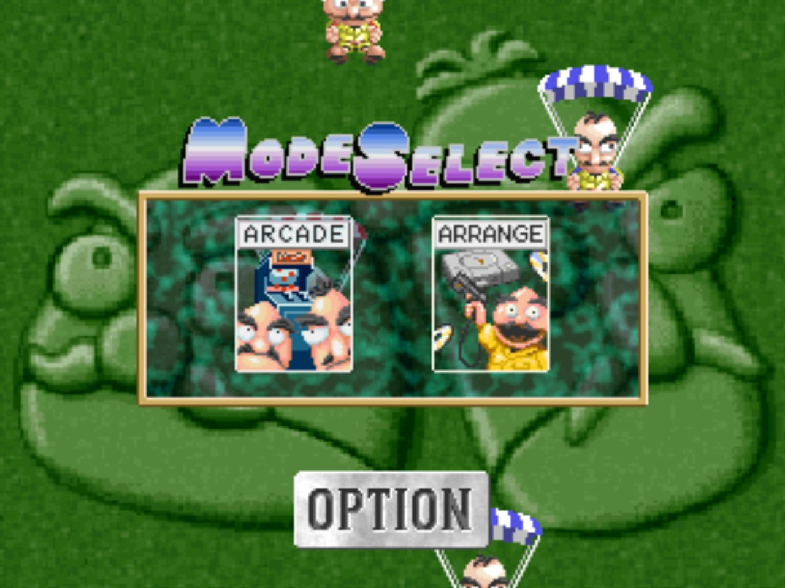</td>
<td valign="middle">

### Menus
Everything is chosen by shooting it, like the original. Shoot **NO** to skip loading a memory card, then **Arcade** or **Arrange**, and pick a difficulty and stage the same way.

</td>
</tr>
</table>

## The launcher

Everything is set up before the game starts. Install your disc, pick your controls and choose the PC graphics options, then press **Play**.

<table>
<tr>
<td width="55%">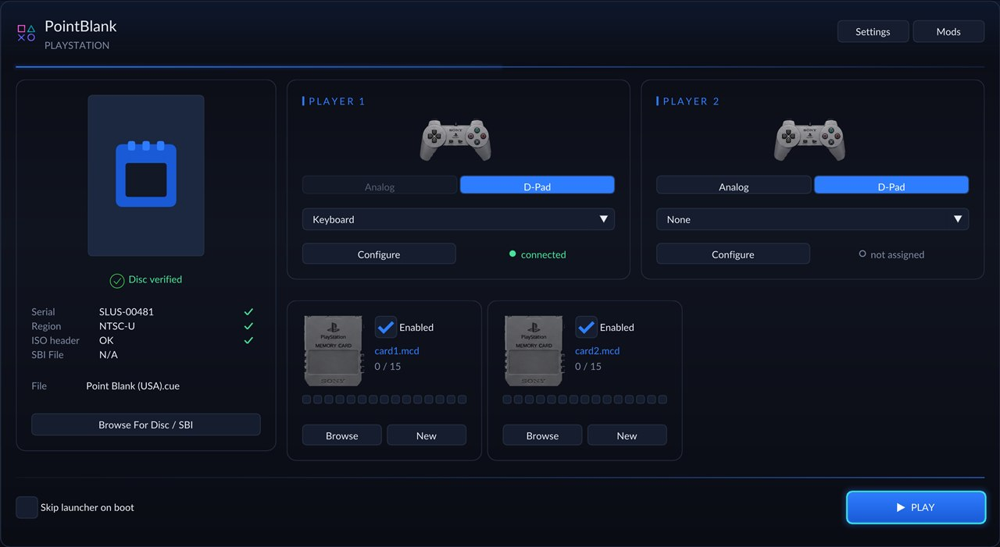</td>
<td valign="middle">

### Install your disc
- **Browse For Disc**: pick your `Point Blank (USA).cue`
- The launcher checks it is the right game (serial, region and image) and shows **Disc verified**
- **Install To Game Folder** copies the disc next to the game with a progress bar, so it keeps working if the original is moved
- Two memory cards, player devices, and **Skip launcher on boot**

</td>
</tr>
<tr>
<td valign="middle">

### Display and graphics
- **Window size**, **fullscreen** (borderless or exclusive) and **VSync** (off, on, adaptive)
- **Internal resolution** from native up to 4K and beyond
- **FXAA**, **sharpening** (contrast adaptive) and **brightness**
- Texture filtering, anti-aliasing, FMV filtering, perspective-correct textures
- CRT **screen model** and **scanlines**, and an **FPS counter**

</td>
<td width="55%">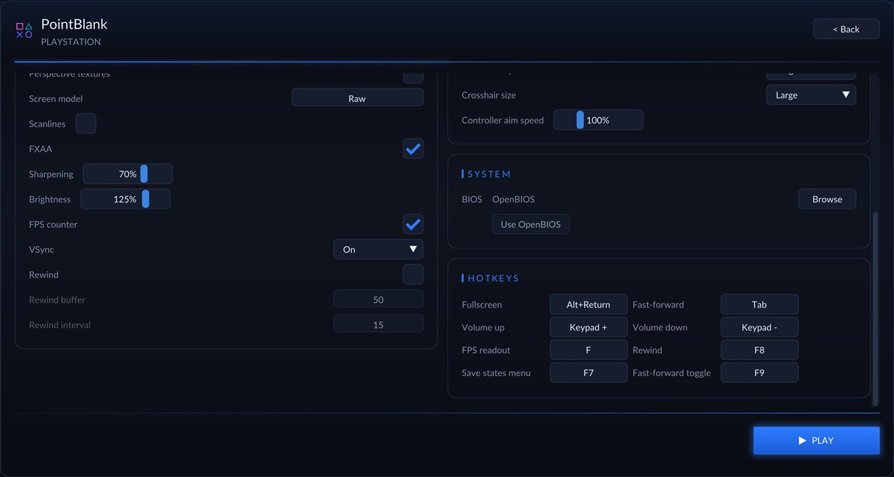</td>
</tr>
<tr>
<td>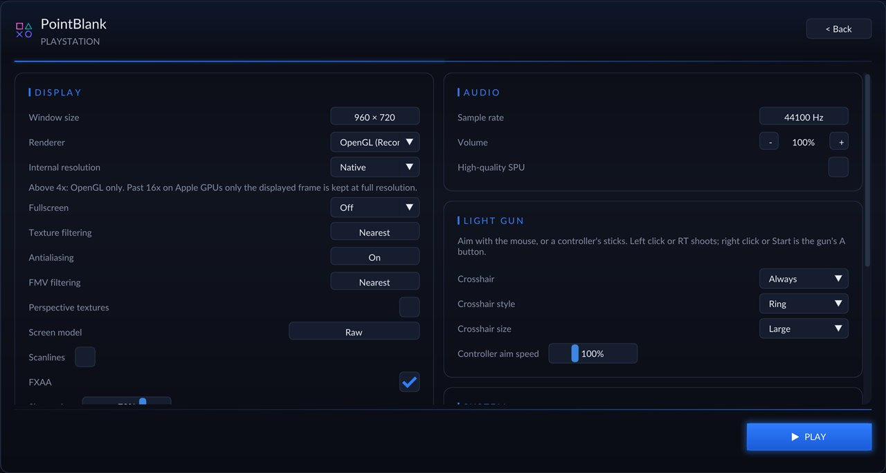</td>
<td valign="middle">

### Light gun
- **Crosshair**: off, only when aiming with a controller, or always (it then replaces the mouse cursor)
- **Crosshair style**: cross, dot or ring, in small, medium or large
- **Controller aim speed** from 25% to 300%
- Audio volume and quality, BIOS choice and rebindable **hotkeys**

</td>
</tr>
</table>

<div align="center">
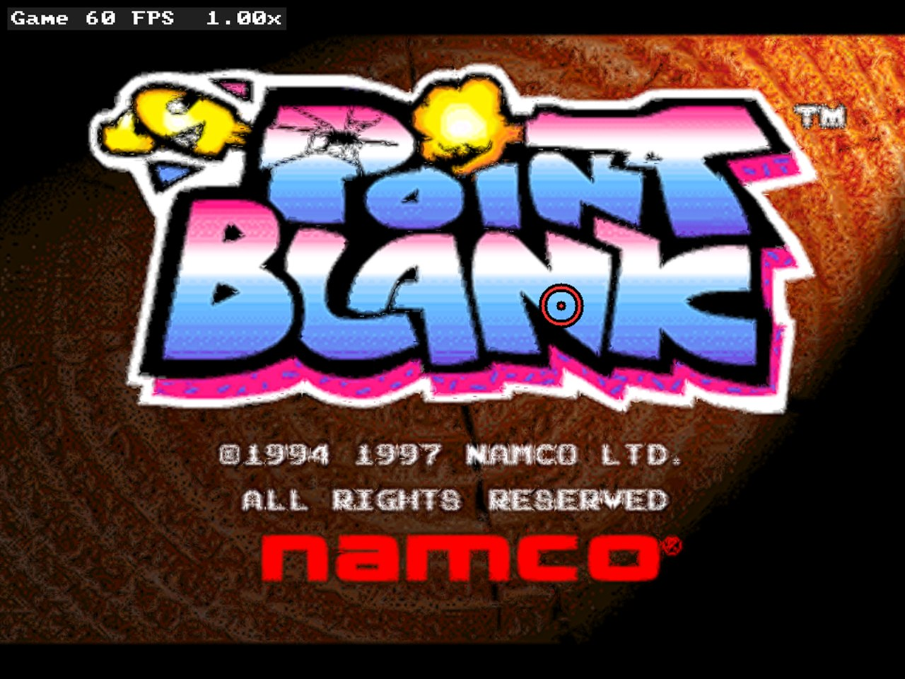
<br><sub>In game with FXAA, sharpening, raised brightness, the FPS counter and the large ring crosshair.</sub>
</div>

## Controls

| Action | Mouse | Controller |
| --- | --- | --- |
| Aim | move the cursor | left stick (fast) or right stick (fine) |
| Shoot | left button | right trigger, A or RB |
| Shoot off-screen | back side button, or point outside the picture | left trigger or B |
| GunCon **A** (start, skip, confirm) | right button | Start or X |
| GunCon **B** | middle button | Back or Y |

The first controller plays as Player 1 alongside the mouse; a second controller becomes Player 2. Screens that say **Press the button**, such as the rules, want **A**.

## Getting started

**You need:** Windows 10 or 11 (64-bit), a graphics card with OpenGL 3.3, and your own disc image of **Point Blank (USA)** as a `.cue` with its `.bin` (Redump `Point Blank (USA)`, serial SLUS-00481).

1. Download `PointBlank-PC-Port-*-windows-x64.zip` from the [latest release](https://github.com/TekRantGaming/point-blank-recompiled/releases/latest) and unzip it anywhere.
2. Run **PointBlank_Recompiled.exe**.
3. In the launcher, press **Browse For Disc** and pick your `Point Blank (USA).cue`. When it says **Disc verified**, press **Install To Game Folder** (optional, but recommended).
4. Choose your settings and press **Play**. The first time, the game asks you to calibrate the gun: shoot the centre of the target, then press **A** (right click or Start).

**The download contains no game data.** The game's pictures, sounds and stages all come from your own disc. Windows SmartScreen may warn about an unrecognised app because the program is not code-signed; choose *More info*, then *Run anyway*.

Settings are saved next to the game in `settings.toml`, and saves in `saves/`. Run `PointBlank_Recompiled.exe --no-launcher` to go straight into the game.

<details>
<summary><b>Building from source (for developers)</b></summary>

```powershell
git clone --recursive https://github.com/TekRantGaming/point-blank-recompiled.git
cd point-blank-recompiled
.\Build-PointBlank.ps1 -Cue "C:\path\to\Point Blank (USA).cue"
```

The script loads the Visual Studio environment and then:

1. builds the recompiler: `cmake -S psxrecomp/recompiler -B build-recompiler -G Ninja`, target `psxrecomp-game psxrecomp-bios`
2. translates the game: `python psxrecomp/psxrecomp_cli.py generate --config game.toml --project-root . --disc <cue>` (writes `generated/`, which is never committed)
3. compiles the runtime with `clang-cl` into `build/` (plain MSVC `cl` cannot build the runtime's C11 atomics); after that, `build.bat` rebuilds

Game settings live in [`game.toml`](game.toml); `[controller] guncon_ports = [1, 2]` is what plugs in the guns.

</details>

## How it works

- **[PSXRecomp](https://github.com/mstan/psxrecomp)** reads the game's PlayStation executable and translates its MIPS R3000 machine code into C, about 2,600 functions. That C is compiled into a normal Windows program and linked with a runtime that behaves like the PlayStation hardware (graphics, sound, CD drive, controllers), with the open-source [OpenBIOS](https://github.com/grumpycoders/pcsx-redux) in place of Sony's BIOS.
- PSXRecomp had no light-gun support, so this port adds a **Namco GunCon (NPC-103)** to its controller emulation. The gun answers the game with its ID and the screen position where it "saw" the TV's electron beam. The port works that position out from your cursor or sight and the game's own video timing, the same way the [DuckStation](https://github.com/stenzek/duckstation) emulator does.
- Port 2's gun only plugs itself in while a second controller is connected, so the game never waits on a calibration screen for a player who isn't there.
- The framework changes are on the [`pointblank` branch of TekRantGaming/psxrecomp](https://github.com/TekRantGaming/psxrecomp/tree/pointblank).

## Credits

- **Point Blank** (Gunbullet in Japan) by Namco, PlayStation version 1997.
- [**PSXRecomp**](https://github.com/mstan/psxrecomp) by Matthew Stanley and the RetroPortingToolkit team, which does the code translation and runs the game, with [**recomp-ui**](https://github.com/RetroPortingToolKit/recomp-ui) for the launcher.
- [**OpenBIOS**](https://github.com/grumpycoders/pcsx-redux) from the PCSX-Redux project, [**SDL**](https://www.libsdl.org/) and [**Dear ImGui**](https://github.com/ocornut/imgui).
- [**psx-spx**](https://psx-spx.consoledev.net/) for documenting the GunCon.

PSXRecomp is under the [PolyForm Noncommercial License 1.0.0](https://github.com/mstan/psxrecomp/blob/master/LICENSE), so this port is for non-commercial use only.

> [!NOTE]
> **AI disclosure:** this port was made almost entirely with Claude Code (Anthropic). The repository owner directed and tested the work; the AI did the analysis, code, tools and documentation.

> [!IMPORTANT]
> This project is not affiliated with or endorsed by Bandai Namco Entertainment or Sony. It contains no game code or assets. Do not open issues asking for game files.
